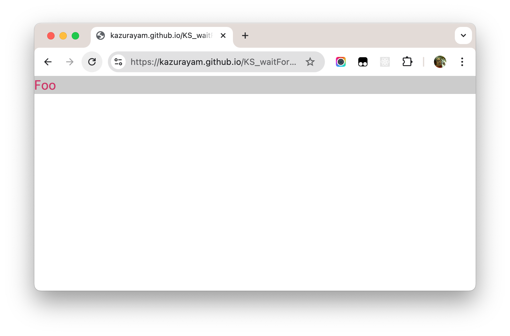
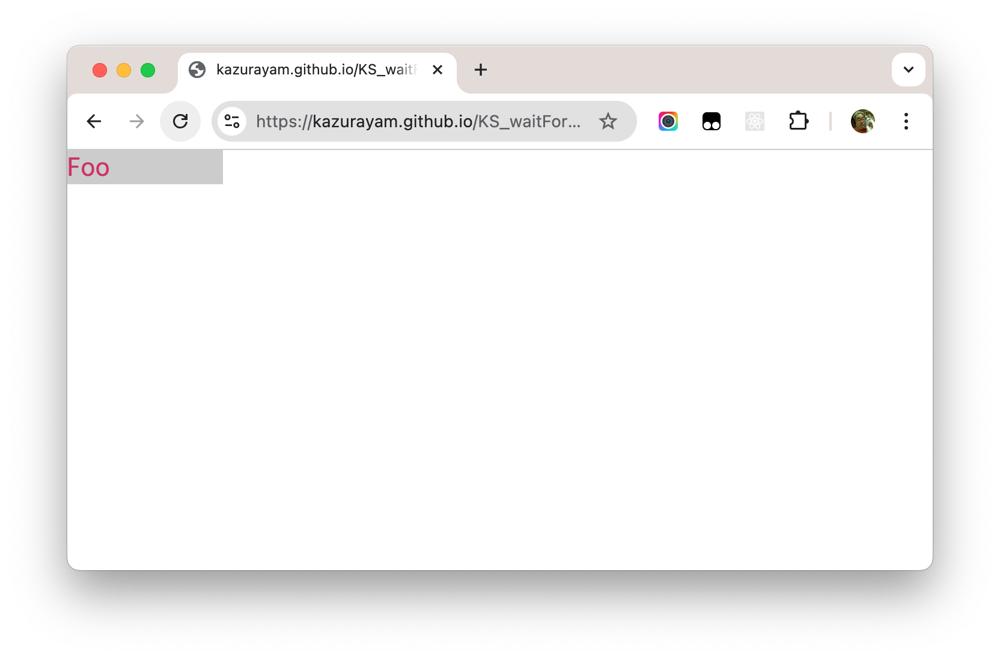
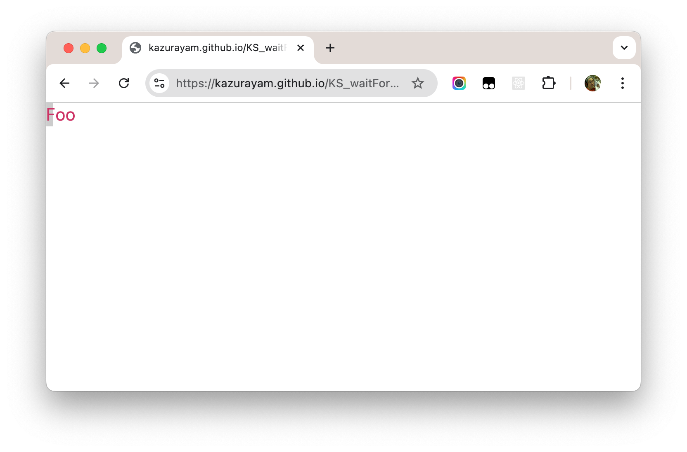
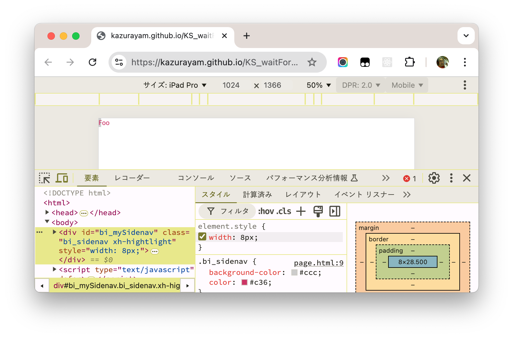

# Katalon Studio Custom keyword: waitForElementAttributeWithPattter

## Application UnderTest

Please click the following link to open a public URL as a testbed:

-   [The target web page](https://kazurayam.github.io/KS_waitForElementAttributeWithPatternKeyword/page.html)

This web page starts with an initial view like this:

Please note a grey band in the background of "Foo" text spans full width of the browser window.

In a couple seconds after the page loading, a poor animation begins: the grey band starts shrinking:

finally, the width of the grey band reaches almost 0px.

You can read the source of the web page

    <!DOCTYPE html>
    <html>
    <head>
      
      
    </head>
    <body>

      
Foo

      
    </body>
    </html>

If you look into the DOM of this web page, you would notice that the `
` element initially has no `style` attribute. But as soon as JavaScript fires, the `style` attribute is created. The `style` attribute contains the `width: Xpx` value where the digit `X` quickly moves down near to 0.

Now I want to test if the `
` element has an `style` attribute with value of `"width: Xpx;"` (X is a certain small digit). How can I do it?

## TC0 using WebUI.getAttribute

At firt, let me show you a naive test case: `TC0`.

    import static com.kazurayam.ks.TestObjectFactory.makeTestObject

    import com.kms.katalon.core.testobject.TestObject
    import com.kms.katalon.core.webui.keyword.WebUiBuiltInKeywords as WebUI

    /**
     * TC0 calls WebUI.getAttribute() keyword as soon as the page is loaded. 
     * This test fails.
     * 
     */
    String url = "https://kazurayam.github.io/KS_waitForElementAttributeWithPatternKeyword/page.html"
    WebUI.openBrowser('')
    WebUI.setViewPortSize(800, 600)
    WebUI.navigateToUrl(url);

    TestObject tObj = makeTestObject("Side Navigation Window", "//*[@id='bi_mySidenav']");
    WebUI.verifyElementPresent(tObj, 3);

    String attrValue = WebUI.getAttribute(tObj, 'style')
    println "attrValue=" + attrValue

    assert attrValue != null
    assert attrValue.length() > 0

    WebUI.closeBrowser()

This test case immediately fails:

    2025-01-21 21:48:08.374 INFO  c.k.katalon.core.main.TestCaseExecutor   - --------------------
    2025-01-21 21:48:08.379 INFO  c.k.katalon.core.main.TestCaseExecutor   - START Test Cases/TC0
    2025-01-21 21:48:09.616 INFO  c.k.k.core.webui.driver.DriverFactory    - Starting 'Chrome' driver
    1月 21, 2025 9:48:09 午後 org.openqa.selenium.remote.DesiredCapabilities chrome
    情報: Using `new ChromeOptions()` is preferred to `DesiredCapabilities.chrome()`
    2025-01-21 21:48:09.661 INFO  c.k.k.c.w.util.WebDriverPropertyUtil     - User set preference: ['excludeSwitches', '[enable-automation]']
    2025-01-21 21:48:09.703 INFO  c.k.k.core.webui.driver.DriverFactory    - Action delay is set to 0 milliseconds
    Starting ChromeDriver 131.0.6778.204 (52183f9e99a61056f9b78535f53d256f1516f2a0-refs/branch-heads/6778_155@{#7}) on port 21461
    Only local connections are allowed.
    Please see https://chromedriver.chromium.org/security-considerations for suggestions on keeping ChromeDriver safe.
    ChromeDriver was started successfully on port 21461.
    1月 21, 2025 9:48:13 午後 org.openqa.selenium.remote.ProtocolHandshake createSession
    情報: Detected dialect: W3C
    2025-01-21 21:48:13.735 INFO  c.k.k.core.webui.driver.DriverFactory    - sessionId = e165446d40c951bf3cc6ee7651c38366
    2025-01-21 21:48:13.934 INFO  c.k.k.core.webui.driver.DriverFactory    - browser = Chrome 131.0.0.0
    2025-01-21 21:48:13.956 INFO  c.k.k.core.webui.driver.DriverFactory    - platform = Mac OS X
    2025-01-21 21:48:13.978 INFO  c.k.k.core.webui.driver.DriverFactory    - seleniumVersion = 3.141.59
    2025-01-21 21:48:13.999 INFO  c.k.k.core.webui.driver.DriverFactory    - proxyInformation = ProxyInformation { proxyOption=NO_PROXY, proxyServerType=HTTP, username=, password=********, proxyServerAddress=, proxyServerPort=0, executionList="", isApplyToDesiredCapabilities=true }
    attrValue=
    2025-01-21 21:48:15.736 ERROR c.k.katalon.core.main.TestCaseExecutor   - ❌ Test Cases/TC0 FAILED.
    Reason:
    Assertion failed:

    assert attrValue.length() > 0
           |         |        |
           ''        0        false

        at TC0.run(TC0:23)
        at com.kms.katalon.core.main.ScriptEngine.run(ScriptEngine.java:194)
        at com.kms.katalon.core.main.ScriptEngine.runScriptAsRawText(ScriptEngine.java:119)
        at com.kms.katalon.core.main.TestCaseExecutor.runScript(TestCaseExecutor.java:448)
        at com.kms.katalon.core.main.TestCaseExecutor.doExecute(TestCaseExecutor.java:439)
        at com.kms.katalon.core.main.TestCaseExecutor.processExecutionPhase(TestCaseExecutor.java:418)
        at com.kms.katalon.core.main.TestCaseExecutor.accessMainPhase(TestCaseExecutor.java:410)
        at com.kms.katalon.core.main.TestCaseExecutor.execute(TestCaseExecutor.java:285)
        at com.kms.katalon.core.main.TestCaseMain.runTestCase(TestCaseMain.java:144)
        at com.kms.katalon.core.main.TestCaseMain.runTestCase(TestCaseMain.java:135)
        at TempTestCase1737463681594.run(TempTestCase1737463681594.groovy:25)
        at java.base/jdk.internal.reflect.NativeMethodAccessorImpl.invoke0(Native Method)
        at java.base/jdk.internal.reflect.NativeMethodAccessorImpl.invoke(NativeMethodAccessorImpl.java:77)
        at java.base/jdk.internal.reflect.DelegatingMethodAccessorImpl.invoke(DelegatingMethodAccessorImpl.java:43)

    2025-01-21 21:48:15.748 ERROR c.k.katalon.core.main.TestCaseExecutor   - ❌ Test Cases/TC0 FAILED.
    Reason:
    Assertion failed:

    assert attrValue.length() > 0
           |         |        |
           ''        0        false

        at TC0.run(TC0:23)
        at com.kms.katalon.core.main.ScriptEngine.run(ScriptEngine.java:194)
        at com.kms.katalon.core.main.ScriptEngine.runScriptAsRawText(ScriptEngine.java:119)
        at com.kms.katalon.core.main.TestCaseExecutor.runScript(TestCaseExecutor.java:448)
        at com.kms.katalon.core.main.TestCaseExecutor.doExecute(TestCaseExecutor.java:439)
        at com.kms.katalon.core.main.TestCaseExecutor.processExecutionPhase(TestCaseExecutor.java:418)
        at com.kms.katalon.core.main.TestCaseExecutor.accessMainPhase(TestCaseExecutor.java:410)
        at com.kms.katalon.core.main.TestCaseExecutor.execute(TestCaseExecutor.java:285)
        at com.kms.katalon.core.main.TestCaseMain.runTestCase(TestCaseMain.java:144)
        at com.kms.katalon.core.main.TestCaseMain.runTestCase(TestCaseMain.java:135)
        at TempTestCase1737463681594.run(TempTestCase1737463681594.groovy:25)
        at java.base/jdk.internal.reflect.NativeMethodAccessorImpl.invoke0(Native Method)
        at java.base/jdk.internal.reflect.NativeMethodAccessorImpl.invoke(NativeMethodAccessorImpl.java:77)
        at java.base/jdk.internal.reflect.DelegatingMethodAccessorImpl.invoke(DelegatingMethodAccessorImpl.java:43)

    2025-01-21 21:48:16.353 WARN  c.k.katalon.core.main.TestCaseExecutor   - Failed connecting to tab web socket.
    2025-01-21 21:48:16.365 INFO  c.k.katalon.core.main.TestCaseExecutor   - END Test Cases/TC0

The call to `WebUI.getAttribute(TestObject, 'style')` failed because the `
` element has no `style` attribute on the page load.

## TC1 using WebUI.waitForElementAttribute
